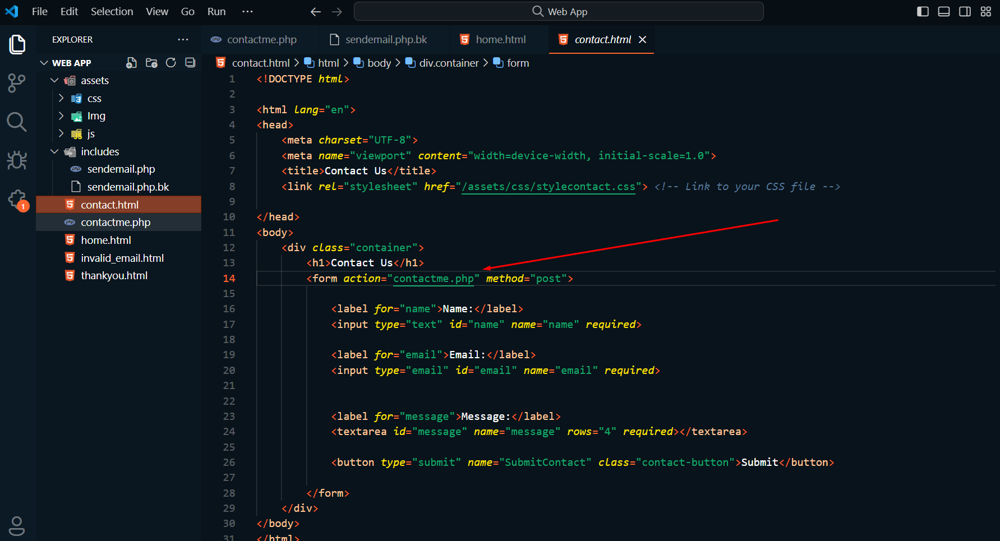
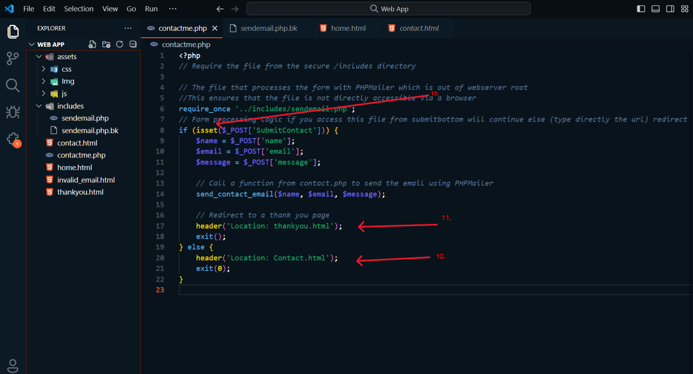

This is the second chapter of how to build a website. To see how to set up the website, you can check out [<b>Web App Azure</b>](https://github.com/AngelcoreS/Web-App-Azure).

In this tutorial, I’ll walk you through the steps I took to create a fully functional contact form email using PHPMailer. Throughout this process, I sharpened my skills in PHP and JavaScript, and gained hands-on experience with web servers, specifically NGINX. One of the most significant challenges I faced was programming the PHP integration in a way that prevents errors or redirects in the case of invalid inputs, using input sanitization for security purposes.

I also set up the structure on the website in a way that keeps the main PHP file outside the web server's wwwroot directory and hides the .php extension in the URL.

/site  
├── /wwwroot  
│   ├── /assets   
│   │   ├── /css  
│   │   │   └── styles.css  
│   │   ├── /images  
│   │   │   └── logo.png  
│   │   └── /js  
│   │       └── script.js  
│   ├── about.html  
│   ├── contact.html  
│   ├── contactme.php  
│   └── index.html   
├── /includes   
	│   └── sendemail.php          # Sensitive form handling (not publicly accessible)  
	│   ├── PHPMailer.php         # PHPMailer library files  
	│  
	└── /cofig  
 	   └── config.php           # Database config, environment variables  

This tutorial combines both the technical setup and problem-solving skills that helped me overcome various challenges, ensuring a smooth deployment process from code to live website.

While manual deployment may not always be practical due to the availability of frameworks that streamline the process, it was invaluable in strengthening my foundational understanding of how web apps are built and secured.

Once you finish step 1, 2 and 3 of [<b>Web App Azure</b>](https://github.com/AngelcoreS/Web-App-Azure). We are going to deploy this repository instead of the other, following similar Instructions. 

<h2>Deploy Web Blog Sample From Github</h2>

Once connected via SSH in the Azure portal, you’ll be inside the Azure App Service container. First, install Git by running the following command:

`apt update && apt install git`

I recommend removing the entire wwwroot directory and cloning this repository, renaming it to wwwroot inside the same site folder.

At this point, we need to create an includes folder at the same level as the wwwroot folder:

`cd /home/site && mkdir includes`

Next, move the following files: README.md, default, sendemail.php, sendemail.php.bk, and startup.sh to the includes folder.

Now, we need to edit the startup.sh file. Use nano to cut the last command, save the changes, and execute that command directly in the terminal.

This step is necessary because the file was cloned from GitHub and contains hidden carriage return characters (\r) at the end of each line, which causes errors when executed.

In the Azure portal, navigate to Configuration under Settings. In the Startup Command box, enter the absolute path of the startup.sh file to ensure that it runs every time the app starts. This will apply the necessary configuration changes automatically, even after Azure scales or makes adjustments to the environment.

Finally, open a browser and navigate to your App Service URL:

<h2>The NGINX configuration file</h2>

You will notice that the URL ends with the .html extension. Omitting file extensions from your URLs improves security, usability, flexibility, and search engine performance, while also giving your website a cleaner and more professional appearance.

To achieve this, we need to modify the Nginx configuration file located at /etc/nginx/sites-available/default.

Since we already have this file inside the includes folder, execute the startup.sh script to automatically update the default configuration file:

`sh /home/includes/startup.sh`

In this update, I made some changes compared to the previous tutorial. Instead of using the rewrite directive, I opted for return, [<b>based on this Stack Overflow discussion</b>](https://stackoverflow.com/questions/38228393/nginx-remove-html-extension) . Start with a 302 temporary redirect, and once everything works as expected, switch to a 301 redirect, which indicates a permanent change and will be cached.

<h2>PHP file configuration</h2>

Here, we need to ensure that the fastcgi_pass directive (commonly found in the Nginx configuration files when you're configuring Nginx to work with a backend FastCGI process like PHP-FPM) is set to listen in the same pool configuration file.

To find where PHP-FPM is running, execute the following command:

`ps aux | grep php-fpm`

This will show you the location where php-fpm is running (/usr/local/etc/php-fpm.conf)

Next, use the following command to easily find the listen directive in the PHP-FPM pool configuration:

`grep -R "listen =" /usr/local/etc/php-fpm.d/www.conf`

The result of this command is what you will set in the fastcgi_pass directive in your Nginx configuration.

And here is the Contact.html file, which will send the form data (name, email, message, submitContact) to contactme.php:

I'll explain how this PHP script works in detail later but first we need to install Composer and PHPMailer.

<h2>Installing Composer</h2>

There’s no need to reinvent the wheel—we’re not writing a PHP program to interact directly with SMTP or creating an SMTP server. Instead, we’ll use Composer, a dependency manager for PHP, which allows us to easily install and manage libraries like PHPMailer.

Composer simplifies the process of handling external libraries by resolving dependencies and downloading them. It ensures that the correct versions of libraries are used in your project, making the development process more streamlined.

First, we need to install Composer. It’s recommended to install the files in the includes folder.

Navigate to your includes folder:

`cd /home/site/includes`

Update your package manager:

`apt update`

Download Composer’s installer script:

`curl -sS https://getcomposer.org/installer -o composer-setup.php`

Install Composer globally:

`php composer-setup.php --install-dir=/usr/local/bin --filename=composer`

Verify Composer installation:

`composer -v`

This command will check if Composer was installed correctly by displaying the version number and available commands.

<h2>Installing PHPMailer</h2>

The next step is to install PHPMailer using Composer. While inside the same includes folder, run the following command:

`composer require phpmailer/phpmailer`

This command will automatically handle all dependencies and library management for PHPMailer.

You can explore more details about PHPMailer on its GitHub repository by clicking [<b>PHPMailer</b>](https://github.com/PHPMailer/PHPMailer). There are many resources available, including a simple example that will serve as the foundation for the script I will explain next.

<h2>Securing PHP Files</h2>

By keeping your PHP files separate from public access (wwwroot), you minimize the risk of accidental exposure, which is critical for security. The only PHP file inside wwwroot is contactme.php.

10-12. In this file, I use a conditional to check if it was executed by clicking the SubmitContact button using the isset function. If so, it will save the name, email, and message into variables, then require the sendemail.php file using require_once and call the send_contact_email function. Afterward, it will redirect to the thankyou.html file. If the form wasn't submitted, it will redirect to Contact.html, preventing direct access to the PHP file by typing its URL.

Next is the main function, which I based on a simple example from their GitHub repository.

1. I declared the function send_contact_email to retrieve the variables. By using filter_var, it checks the validity of the email. If the email is invalid, it will redirect to invalid_email.html and exit. If the email is valid, it will proceed with the data we need to change.

3. Username: This should be your Gmail address that you have access to.

4. Password: You'll need to obtain an app-specific password from Google, which requires enabling 2-Step Verification on your Google account.

Enable 2-Step Verification in your Google account settings.

Generate an app-specific password, search for "app paswords".

Create and use this password in your PHP script.

5. Regarding setFrom, due to Google’s policies on email spoofing and preventing malicious activity, you cannot use a different email in the setFrom field that doesn't match your Gmail account. This restriction is part of Google’s anti-spam policies, which aim to prevent unauthorized use of Gmail for sending fraudulent or deceptive emails.

6. The addAddress method specifies the recipient of the email. This can be the same Gmail account you’re using or any other email address you want to send the message to, allowing you to check incoming emails easily
 

7. Subject and Body of the email: These are customizable, so you can edit them as needed to fit your message.

8-9. If the email is successfully sent, it will redirect to thankyou.html. If the email fails to send, it will redirect to Contact.html.

Now, to test it out, try submitting a contact form. If you enter an invalid email (e.g., usuario@correo), it will redirect you to invalid_email.html, which is a separate page.

Next, try typing your-URL/contactme.php directly into your browser. It should redirect to Contact.html again, preventing direct access to the PHP script.

Finally, submit the form correctly, and you should receive something like this:

